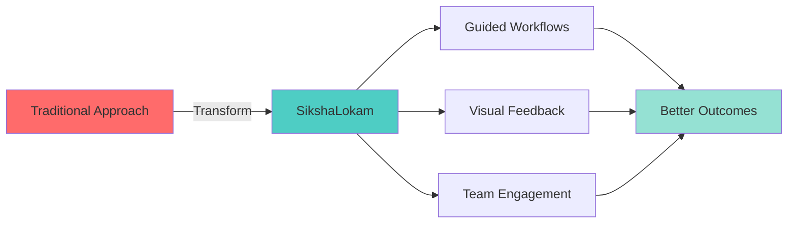
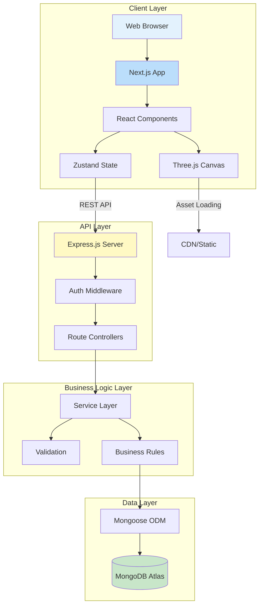
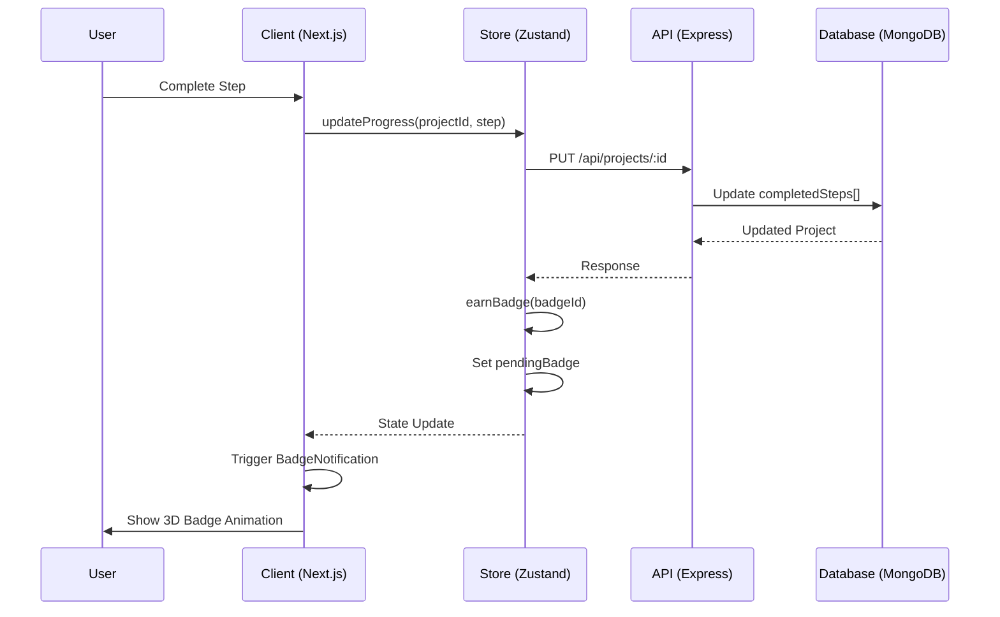
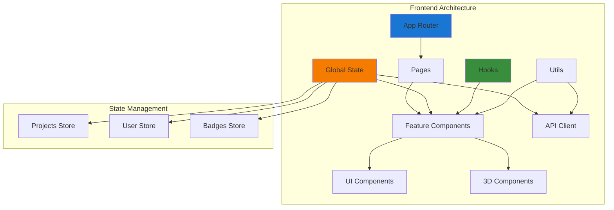
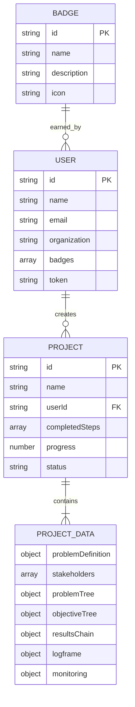
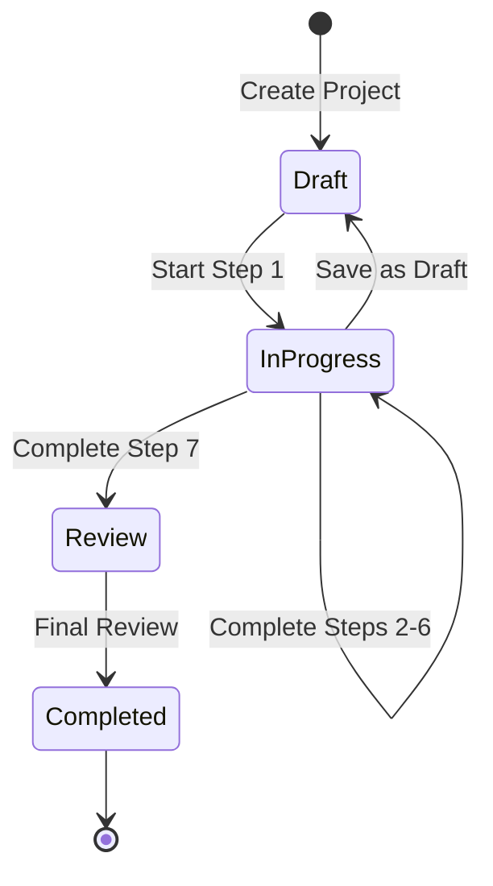

<div align="center">

# 🎓 SikshaLokam

### Transform Education Leadership Through Gamified Impact Management

[](https://opensource.org/licenses/MIT)
[](https://nextjs.org/)
[](https://www.typescriptlang.org/)
[](https://nodejs.org/)
[](https://www.mongodb.com/)
[](https://www.docker.com/)

[Features](#-features) • [Architecture](#-system-architecture) • [Getting Started](#-quick-start) • [Documentation](#-documentation) • [Contributing](#-contributing)

</div>

---

## 📋 Table of Contents

- [Overview](#-overview)
- [Problem Statement](#-problem-statement)
- [Solution](#-solution)
- [Features](#-features)
- [Architecture](#-system-architecture)
- [Technology Stack](#-technology-stack)
- [Project Structure](#-project-structure)
- [Quick Start](#-quick-start)
- [Documentation](#-documentation)
- [API Reference](#-api-reference)
- [License](#-license)
---

## 🌟 Overview

**SikshaLokam** is an open-source platform that revolutionizes educational program management by combining rigorous logical frameworks with engaging gamification mechanics. We empower education leaders, NGOs, and policy makers to design, implement, and measure the impact of educational interventions at scale.

### Key Highlights

- 🎮 **Immersive Gamification** - 3D planetary badges and achievement system
- 📊 **Logical Framework Approach** - Industry-standard project planning methodology
- 🤖 **AI-Powered Templates** - Smart project templates based on best practices
- 📈 **Real-time Analytics** - Live progress tracking and impact measurement
- 🌍 **Open Source** - Community-driven development and transparent roadmap

---

## Problem Statement

Educational programs face three critical challenges:

1. **Complexity Overload** - Creating logical frameworks (problem trees, result chains, logframes) is time-consuming and requires specialized expertise
2. **Low Engagement** - Traditional program management tools are dry and fail to motivate teams
3. **Impact Blindness** - Difficulty in tracking progress and measuring real-world outcomes

---

## Solution

SikshaLokam bridges the gap between rigorous methodology and engaging user experience:



### Our Approach

- **Structured Guidance** - 7-step methodology from problem definition to M&E framework
- **Gamification** - Earn 3D planetary badges, unlock achievements, track XP
- **Templates** - Pre-built frameworks for common education interventions
- **Collaboration** - Team workspaces with role-based access control

---

## ✨ Features

### 🎮 Gamification System

<table>
<tr>
<td width="50%">

**3D Interactive Badges**
- Stunning Three.js powered planetary badges
- Real-time particle effects and animations
- Progressive unlocking system
- 10+ unique achievement types

</td>
<td width="50%">

**Achievement Mechanics**
- XP and leveling system
- Streak tracking for consistency
- Leaderboards (coming soon)
- Team challenges (coming soon)

</td>
</tr>
</table>

### 📊 Logical Framework Tools

#### Problem Analysis
- **Problem Tree** - Visual cause-effect mapping with drag-and-drop interface
- **Stakeholder Analysis** - Identify and categorize key stakeholders
- **Context Mapping** - Define geographic scope and urgency

#### Solution Design
- **Objective Tree** - Transform problems into actionable objectives
- **Results Chain** - Map inputs → activities → outputs → outcomes → impact
- **Logical Framework Matrix** - Industry-standard logframe with indicators, MoV, and assumptions

#### Monitoring & Evaluation
- **Indicator Framework** - SMART indicators with baselines and targets
- **Data Collection Plan** - Structured approach to evidence gathering
- **Progress Tracking** - Real-time status updates and milestone completion

### 🛠️ Project Management

- **Smart Templates** - 6+ pre-built templates for education programs
- **Workflow Automation** - Guided steps with validation and auto-save
- **Progress Visualization** - Interactive progress bars and completion metrics
- **Export Capabilities** - Generate PDF reports and Excel data exports

---

## 🏗️ System Architecture

### High-Level Architecture



### Data Flow Architecture



### Component Architecture



### Database Schema



---

## 🔧 Technology Stack

### Frontend

| Technology | Purpose | Version |
|-----------|---------|---------|
| **Next.js** | React framework with App Router | 15.0+ |
| **TypeScript** | Type-safe development | 5.0+ |
| **Tailwind CSS** | Utility-first styling | 4.0+ |
| **Zustand** | Lightweight state management | 4.x |
| **Three.js** | 3D graphics and animations | r128+ |
| **React Three Fiber** | React renderer for Three.js | 8.x |
| **Radix UI** | Accessible component primitives | Latest |
| **Framer Motion** | Advanced animations | 11.x |
| **Canvas Confetti** | Celebration effects | Latest |
| **Lucide React** | Icon system | Latest |

### Backend

| Technology | Purpose | Version |
|-----------|---------|---------|
| **Node.js** | JavaScript runtime | 22.x |
| **Express.js** | Web application framework | 4.x |
| **MongoDB** | NoSQL database | Atlas |
| **Mongoose** | MongoDB ODM | 8.x |
| **JWT** | Authentication tokens | Latest |
| **bcryptjs** | Password hashing | Latest |
| **PDFKit** | PDF generation | Latest |
| **ExcelJS** | Excel export | Latest |

### DevOps

| Tool | Purpose |
|------|---------|
| **Docker** | Containerization |
| **Docker Compose** | Multi-container orchestration |
| **ESLint** | Code linting |
| **Prettier** | Code formatting |
| **Git** | Version control |

---

## 📁 Project Structure

```
SikshaLokam/
│
├── 📂 frontend/                    # Next.js Application
│   ├── 📂 app/                     # App Router (Next.js 15)
│   │   ├── 📂 (auth)/              # Auth routes group
│   │   │   ├── login/
│   │   │   └── register/
│   │   ├── 📂 (dashboard)/         # Protected routes group
│   │   │   ├── dashboard/
│   │   │   ├── projects/
│   │   │   └── steps/
│   │   ├── layout.tsx              # Root layout
│   │   ├── page.tsx                # Landing page
│   │   └── globals.css             # Global styles
│   │
│   ├── 📂 components/              # React Components
│   │   ├── 📂 app/                 # Feature components
│   │   │   ├── BadgeNotification.tsx    # 3D badge popup
│   │   │   ├── ProjectCard.tsx          # Project display
│   │   │   ├── StepProgress.tsx         # Progress tracker
│   │   │   └── ProblemTree.tsx          # Problem analysis
│   │   ├── 📂 ui/                  # Shadcn/Radix primitives
│   │   │   ├── button.tsx
│   │   │   ├── dialog.tsx
│   │   │   ├── card.tsx
│   │   │   └── ...
│   │   └── 📂 landing/             # Landing page sections
│   │       ├── Hero.tsx
│   │       ├── Features.tsx
│   │       └── Testimonials.tsx
│   │
│   ├── 📂 lib/                     # Utilities
│   │   ├── demo-store.ts           # Zustand store (state management)
│   │   ├── utils.ts                # Helper functions
│   │   ├── api-client.ts           # API wrapper
│   │   └── constants.ts            # App constants
│   │
│   ├── 📂 public/                  # Static assets
│   │   ├── 📂 models/              # 3D models (.glb)
│   │   ├── 📂 images/              # Images
│   │   └── 📂 icons/               # Icons
│   │
│   ├── package.json
│   ├── tsconfig.json
│   ├── tailwind.config.ts
│   └── next.config.js
│
├── 📂 backend/                     # Express.js API Server
│   ├── 📂 config/                  # Configuration
│   │   └── db.js                   # MongoDB connection
│   │
│   ├── 📂 controllers/             # Request handlers
│   │   ├── authController.js       # Auth logic
│   │   ├── projectController.js    # Project CRUD
│   │   └── exportController.js     # PDF/Excel export
│   │
│   ├── 📂 models/                  # Mongoose schemas
│   │   ├── User.js                 # User model
│   │   ├── Project.js              # Project model
│   │   └── Template.js             # Template model
│   │
│   ├── 📂 routes/                  # API routes
│   │   ├── auth.js                 # /api/auth
│   │   ├── projects.js             # /api/projects
│   │   └── export.js               # /api/export
│   │
│   ├── 📂 middleware/              # Express middleware
│   │   ├── auth.js                 # JWT verification
│   │   └── errorHandler.js         # Error handling
│   │
│   ├── 📂 utils/                   # Utility functions
│   │   ├── generatePDF.js          # PDF creation
│   │   └── validators.js           # Input validation
│   │
│   ├── server.js                   # Entry point
│   ├── package.json
│   └── .env.example                # Environment template
│
├── 📂 docs/                        # Documentation
│   ├── API.md                      # API documentation
│   ├── SETUP.md                    # Setup guide
│   └── CONTRIBUTING.md             # Contribution guidelines
│
├── docker-compose.yml              # Container orchestration
├── .gitignore
├── LICENSE
└── README.md                       # You are here
```

---

## 🚀 Quick Start

### Prerequisites

Ensure you have the following installed:

- **Node.js** v18.0.0 or higher ([Download](https://nodejs.org/))
- **npm** v9.0.0 or higher (comes with Node.js)
- **MongoDB** - Local installation or [Atlas account](https://www.mongodb.com/cloud/atlas)
- **Git** ([Download](https://git-scm.com/))

### Installation

#### 1️⃣ Clone the Repository

```bash
git clone https://github.com/madhesh60/SikshaLokam.git
```

#### 2️⃣ Backend Setup

```bash
cd backend

# Install dependencies
npm install

# Create environment file
cp .env.example .env

# Edit .env with your configuration
# Required variables:
#   PORT=5000
#   MONGO_URI=your_mongodb_connection_string
#   JWT_SECRET=your_super_secret_key_min_32_chars
#   NODE_ENV=development

# Start development server
npm run dev
```

The backend will run on `http://localhost:5000`

#### 3️⃣ Frontend Setup

```bash
cd frontend

# Install dependencies
npm install

# Create environment file (optional)
cp .env.example .env.local

# Edit .env.local if using custom backend URL
# NEXT_PUBLIC_API_URL=http://localhost:5000

# Start development server
npm run dev
```

The frontend will run on `http://localhost:3000`

#### 4️⃣ Verify Installation

1. Open your browser and navigate to `http://localhost:3000`
2. You should see the SikshaLokam landing page
3. Click "Get Started" to create an account
4. Complete the onboarding flow
5. Create your first project and earn your first badge! 🎉

### 🐳 Docker Setup (Alternative)

```bash
# Build and start all services
docker-compose up --build

# Run in detached mode
docker-compose up -d

# Stop all services
docker-compose down
```

Access the application at `http://localhost:3000`

---

## 📚 Documentation

### Core Concepts

#### 1. **Logical Framework Approach (LFA)**

The LFA is a systematic methodology for planning, managing, and evaluating projects:

```
Problem Definition → Stakeholder Analysis → Problem Tree → 
Objective Tree → Results Chain → Logframe Matrix → M&E Framework
```

#### 2. **Gamification Mechanics**

- **Badges**: Earned by completing specific milestones
- **Progress Tracking**: Visual representation of completion status
- **Achievements**: Special recognition for exceptional work
- **Streaks**: Consistency rewards (coming soon)

#### 3. **Project Workflow**



### Key Features Guide

<details>
<summary><b>📊 Problem Tree Creation</b></summary>

1. Navigate to **Step 3: Problem Tree**
2. Define your central problem
3. Add causes (root causes of the problem)
4. Add effects (consequences of the problem)
5. Link causes and effects hierarchically
6. Mark as complete to earn the **Root Cause Detective** badge

</details>

<details>
<summary><b>🎯 Results Chain Building</b></summary>

1. Navigate to **Step 5: Results Chain**
2. Define inputs (resources required)
3. Outline activities (what you'll do)
4. List outputs (immediate deliverables)
5. Specify outcomes (short-term changes)
6. Describe impact (long-term transformation)
7. Mark as complete to earn the **Theory Builder** badge

</details>

<details>
<summary><b>🏆 Badge Collection</b></summary>

Available badges:
- 🎯 **First Steps** - Create your first project
- 🔍 **Problem Analyst** - Complete problem definition
- 👥 **Stakeholder Mapper** - Map all stakeholders
- 🌳 **Root Cause Detective** - Build a complete problem tree
- 🏗️ **Solution Architect** - Design the objective tree
- 💡 **Theory Builder** - Create a Theory of Change
- 📊 **Logframe Master** - Complete the Logical Framework Matrix
- 📈 **Impact Measurer** - Set up monitoring framework
- 🏆 **Program Designer** - Complete full program design

</details>

---

## 🔌 API Reference

### Authentication

#### Register User
```http
POST /api/auth/register
Content-Type: application/json

{
  "name": "John Doe",
  "email": "john@example.com",
  "password": "SecurePass123",
  "organization": "Education NGO",
  "role": "Program Manager",
  "experience": "intermediate"
}
```

#### Login
```http
POST /api/auth/login
Content-Type: application/json

{
  "email": "john@example.com",
  "password": "SecurePass123"
}
```

**Response:**
```json
{
  "_id": "507f1f77bcf86cd799439011",
  "name": "John Doe",
  "email": "john@example.com",
  "token": "eyJhbGciOiJIUzI1NiIsInR5cCI6IkpXVCJ9...",
  "badges": []
}
```

### Projects

#### Get All Projects
```http
GET /api/projects
Authorization: Bearer {token}
```

#### Create Project
```http
POST /api/projects
Authorization: Bearer {token}
Content-Type: application/json

{
  "name": "Teacher Training Program",
  "description": "Improving pedagogy skills",
  "templateId": "teacher-training",
  "organization": "Education NGO"
}
```

#### Update Project
```http
PUT /api/projects/:id
Authorization: Bearer {token}
Content-Type: application/json

{
  "completedSteps": [1, 2],
  "progress": 28,
  "status": "in-progress"
}
```

#### Delete Project
```http
DELETE /api/projects/:id
Authorization: Bearer {token}
```

### Badges

#### Award Badge
```http
PUT /api/auth/badges
Authorization: Bearer {token}
Content-Type: application/json

{
  "badgeId": "problem-analyst"
}
```

For complete API documentation, see [API.md](./docs/API.md)


## 📄 License

This project is licensed under the **MIT License** - see the [LICENSE](LICENSE) file for details.

```
MIT License

Copyright (c) 2025 SikshaLokam

Permission is hereby granted, free of charge, to any person obtaining a copy
of this software and associated documentation files (the "Software"), to deal
in the Software without restriction, including without limitation the rights
to use, copy, modify, merge, publish, distribute, sublicense, and/or sell
copies of the Software...
```
