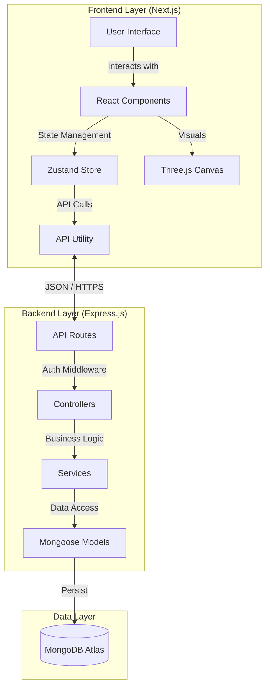

# 🎓 SikshaLokam | Transforming Education at Scale


> **Empowering Education Leaders through Data-Driven Insights and Gamified Impact.**

[](https://opensource.org/licenses/MIT)
[](https://nextjs.org/)
[](https://nodejs.org/)
[](https://www.mongodb.com/)
[](https://threejs.org/)

---

## 🌟 Introduction

**SikshaLokam** is a revolutionary open-source platform designed to resolve the systemic crisis in education leadership. By enabling education leaders to create, track, and improve betterment programs, we bridge the gap between policy and practice.

Our platform leverages **Gamification (3D Badges)**, **Real-time Analytics**, and **AI-driven project templates** to make school improvement not just a task, but an engaging journey of professional growth.

---

## 🚀 Key Features

### 🎮 Immersive Gamification
- **3D Interactive Badges**: Powered by `Three.js` and `React Three Fiber`, users earn stunning 3D planetary badges for completing milestones.
- **Glassmorphism UI**: A premium, modern interface with glass-like effects and smooth animations.
- **Confetti Celebrations**: Real-time visual feedback for achievements using `canvas-confetti`.

### 📊 Impact & Result Management
- **Problem Tree Analysis**: Interactive tools to map causes and effects of educational challenges.
- **Results Chain Framework**: Connect inputs, activities, outputs, and outcomes in a logical flow.
- **Logframe Matrix**: Structured logical framework approach for rigorous project planning.

### 🛠️ Project Management
- **Smart Templates**: Pre-built templates for common educational interventions (e.g., "Teacher Capacity Building").
- **Workflow Automation**: Guided steps from problem definition to impact measurement.
- **Real-time Progress**: Visual progress bars and status tracking for all active projects.

### 🧠 Intelligent Guidance System
- **In-App Learning Mode**: Context-aware tooltips and "How-to" guides (e.g., "What is a good outcome?") build internal capability, transforming the platform into a continuous learning tool.
- **Example Walkthroughs**: Step-by-step interactive tours that mentor users through complex frameworks like LFA.

### 📊 Advanced Analytics & Insights
- **Interactive Dashboard**: A command center showing program health, step completion rates, and time-to-completion metrics.
- **Actionable Recommendations**: AI-driven suggestions on "What to fix next" based on current progress gaps.

### 🤝 Collaborative Workflow (Roadmap)
- **Multi-User Collaboration**: Enable teams to co-create programs with real-time editing and commenting.
- **Approval Logic**: Structured "Draft → Review → Approved" states to support organizational governance and quality control.

---

## 🏗️ Architecture

SikshaLokam follows a modern **Microservices-ready Monolithic** architecture, ensuring scalability and maintainability.



### Data Flow
1.  **Client**: The user interacts with the **Next.js** frontend. State is managed locally via **Zustand** (with persistence).
2.  **API**: Requests are sent to the **Express.js** backend via RESTful endpoints.
3.  **Logic**: The backend processes requests, handles authentication (JWT), and executes business logic.
4.  **Database**: Data is stored and retrieved from **MongoDB**.

---

## 🛠️ Technology Stack

### Frontend
-   **Framework**: [Next.js 15](https://nextjs.org/) (App Router)
-   **Language**: TypeScript
-   **Styling**: Tailwind CSS 4, Radix UI, Lucide Icons
-   **3D Graphics**: Three.js, React Three Fiber, React Three Drei
-   **State Management**: Zustand
-   **Forms**: React Hook Form + Zod Setup
-   **Animations**: Framer Motion (implied usage), CSS Keyframes

### Backend
-   **Runtime**: Node.js
-   **Framework**: Express.js
-   **Database**: MongoDB (Mongoose ODM)
-   **Authentication**: JWT (JSON Web Tokens), bcryptjs
-   **Document Generation**: PDFKit, Docx, ExcelJS

### DevOps & Tools
-   **Containerization**: Docker & Docker Compose
-   **Linting**: ESLint
-   **Version Control**: Git

---

## 📂 Project Structure

```bash
SikshaLokam/
├── backend/                # Express.js Server
│   ├── config/             # DB & Env Config
│   ├── controllers/        # Request Handlers
│   ├── models/             # Mongoose Schemas (Project, User, etc.)
│   ├── routes/             # API Routes
│   ├── middleware/         # Auth & Error Handlers
│   └── server.js           # Entry Point
├── frontend/               # Next.js Client
│   ├── app/                # App Router Pages
│   ├── components/         # Reusable UI Components
│   │   ├── app/            # Feature-specific (BadgeNotification, etc.)
│   │   ├── ui/             # Shadcn/Radix Primitives
│   │   └── landing/        # Landing Page Sections
│   ├── lib/                # Utilities (store, utils, constants)
│   └── public/             # Static Assets (3D models, images)
└── docker-compose.yml      # Container Orchestration
```

---

## ⚡ Getting Started

### Prerequisites
-   Node.js v18+
-   MongoDB (Local or Atlas URI)
-   npm or pnpm

### 1. clone the Repository
```bash
git clone https://github.com/madhesh60/SikshaLokam.git
cd SikshaLokam
```

### 2. Backward Setup
```bash
cd backend
npm install
# Create a .env file with:
# PORT=5000
# MONGO_URI=your_mongodb_uri
# JWT_SECRET=your_secret
npm run dev
```

### 3. Frontend Setup
```bash
cd frontend
npm install
# Create a .env.local file if needed for custom API URL
# NEXT_PUBLIC_API_URL=http://localhost:5000
npm run dev
```

### 4. Access the Platform
Open [http://localhost:3000](http://localhost:3000) to view the application.

---

## 🤝 Contributing

We welcome contributions! Please fork the repository and submit a pull request.

1.  Fork the Project
2.  Create your Feature Branch (`git checkout -b feature/AmazingFeature`)
3.  Commit your Changes (`git commit -m 'Add some AmazingFeature'`)
4.  Push to the Branch (`git push origin feature/AmazingFeature`)
5.  Open a Pull Request

---

## 📜 License

Distributed under the MIT License. See `LICENSE` for more information.
